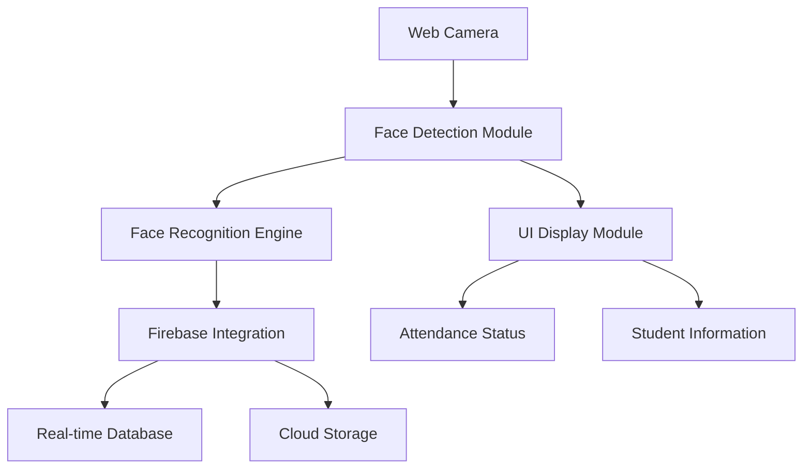
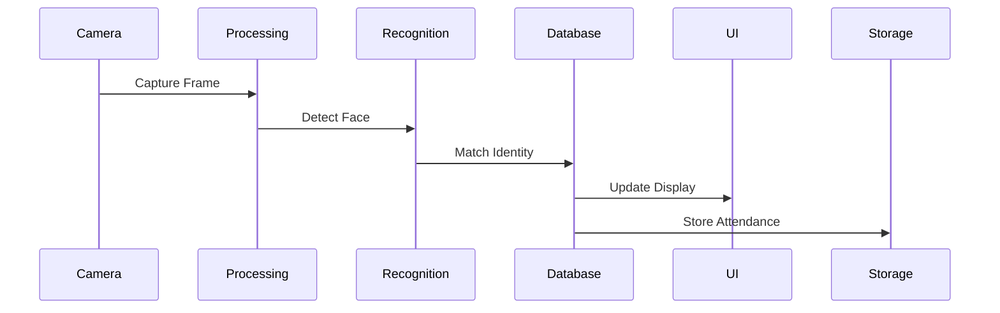
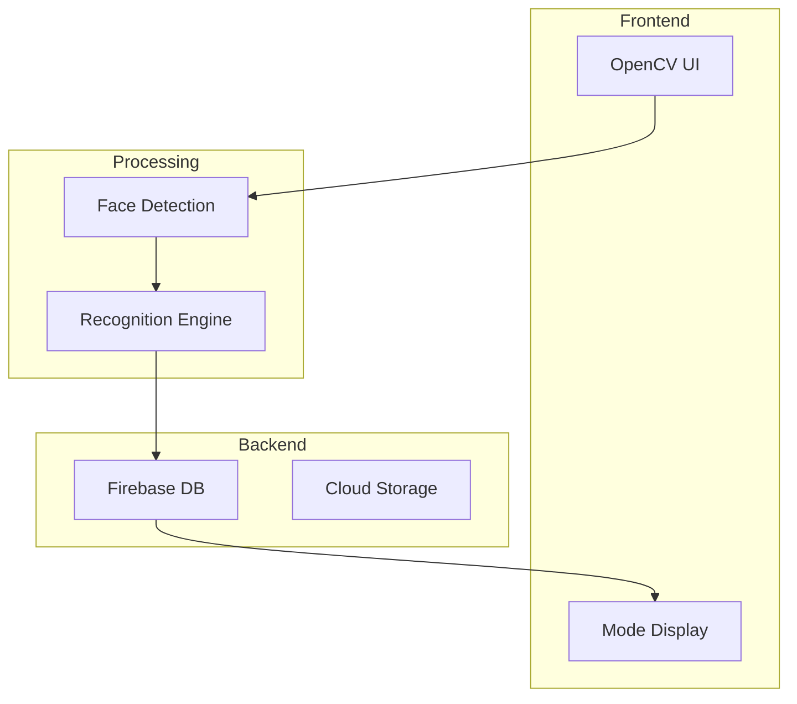
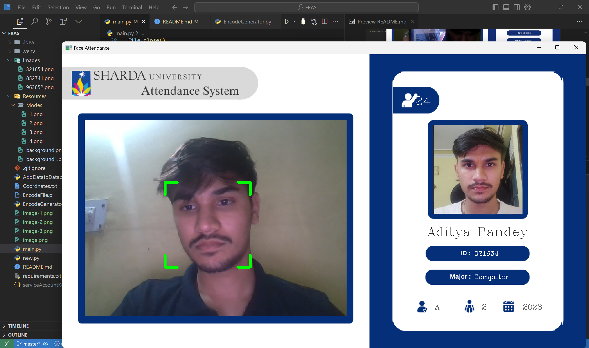
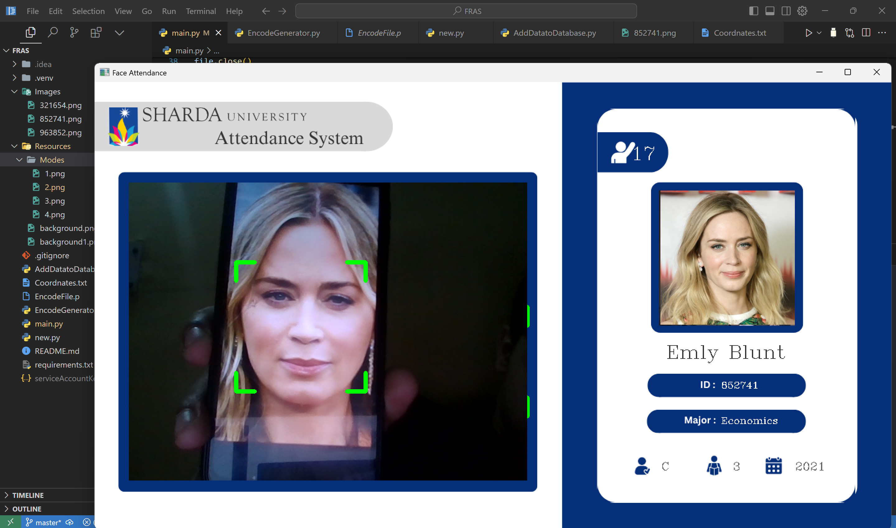
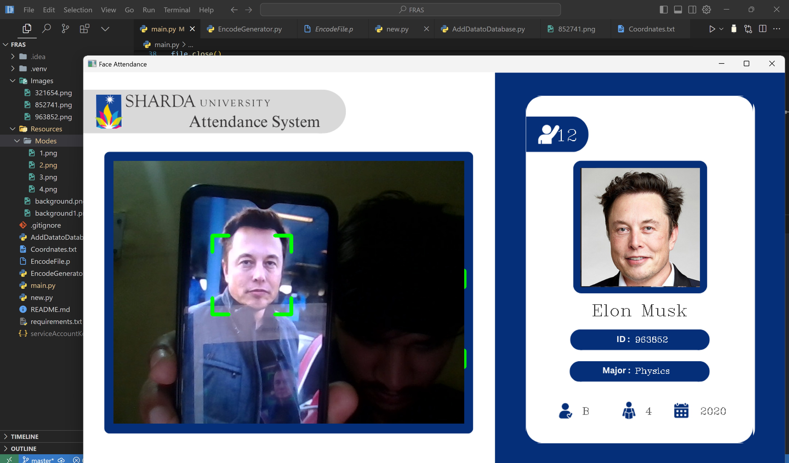
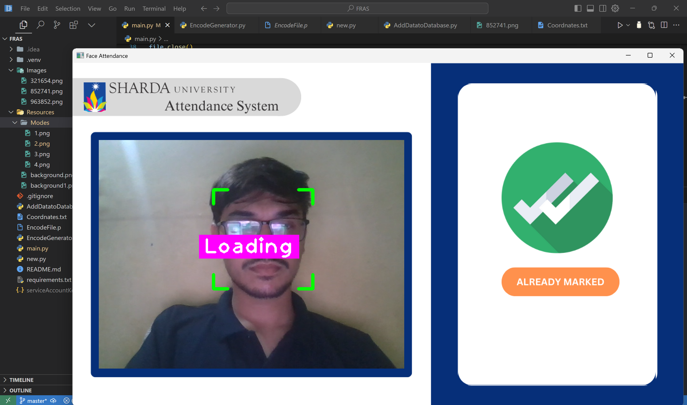
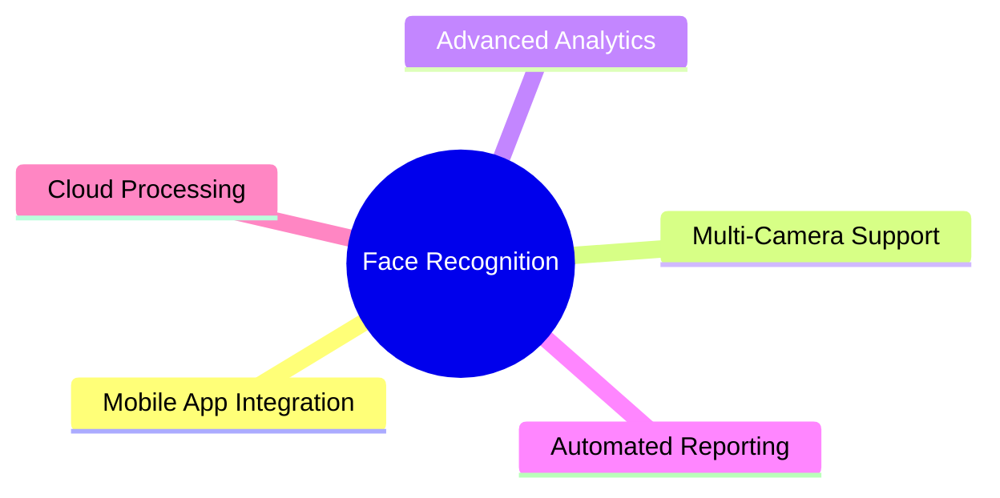

# Face Recognition Attendance System

## Table of Contents
- [Introduction](#introduction)
- [Features](#features)
- [Technologies Used](#technologies-used)
- [Installation](#installation)
- [Usage](#usage)
- [Configuration](#configuration)
- [Database Structure](#database-structure)
- [License](#license)
- [Acknowledgements](#acknowledgements)

## :wave: Introduction

The Face Recognition Attendance System is an advanced, automated solution designed to streamline the process of tracking attendance in educational institutions or workplaces. By leveraging state-of-the-art facial recognition technology, this system provides a contactless, efficient, and accurate method of recording attendance.

## :star: Features

- Real-time face detection and recognition using OpenCV and face_recognition library
- Automated attendance marking with timestamp recording
- Firebase integration for secure data storage and retrieval
- User-friendly graphical interface with custom background and mode displays
- Multi-threaded operations for improved performance
- Configurable attendance rules (e.g., minimum time between markings)
- Detailed logging and debugging information
- Support for multiple students with individual profiles

## 🛠️ Tech Stack

<p align="left">
    
    
    
    
    
    
    
    
    
</p>

- **Python 3.10**: Core programming language
- **OpenCV**: Image processing and computer vision
- **face_recognition**: Facial recognition algorithms
- **Firebase Admin SDK**: Database management and cloud storage
- **NumPy**: Numerical operations on arrays and matrices
- **cvzone**: Additional computer vision utilities
- **Threading**: Concurrent execution for improved performance
- **Pickle**: Data serialization
- **Canva**: UI design and graphics
- **Figma**: Interface prototyping and design
- **Git**: Version control system
- **GitHub**: Code hosting and collaboration platform
- **VS Code**: Code editor and development environment

## :art: System Architecture

### System Overview


### Data Flow


### Component Interaction



## :camera: Screenshots

### State 1: Active State - Face Detection

*System actively detecting and recognizing faces with green bounding box*

### State 2: Updating State - Marking Attendance
#### 1.
#### 2.
#### 3.


### State 3: Already Marked State


### System States Overview
| State | Description |
|-------|-------------|
| Active | System is actively detecting and recognizing faces |
| Updating | Attendance is being recorded in the database |
| Already Marked | Student's attendance has already been recorded |

## :rocket: Installation

1. Clone the repository:
   ```
   git clone https://github.com/your-username/face-recognition-attendance-system.git
   cd face-recognition-attendance-system
   ```

2. Install the required dependencies:
   ```
   pip install -r requirements.txt
   ```

3. Set up Firebase:
   - Create a Firebase project and download the `serviceAccountKey.json`
   - Place the `serviceAccountKey.json` in the project root directory
   - Update the Firebase configuration in the Python scripts with your project details

## :computer: Usage

1. Add student data to the Firebase database:
   ```
   python AddDatatoDatabase.py
   ```

2. Generate face encodings for registered students:
   ```
   python EncodeGenerator.py
   ```

3. Run the main attendance system:
   ```
   python main.py
   ```

4. The system will start the camera and begin recognizing faces. Attendance will be marked automatically for recognized students.

5. Press 'q' to quit the application.

## :wrench: Configuration

You can configure various aspects of the system by modifying the following files:

- `main.py`: Adjust frame processing frequency, attendance rules, and UI layout
- `EncodeGenerator.py`: Customize the encoding process for face recognition
- `AddDatatoDatabase.py`: Modify the structure of student data in the database

## :file_folder: Database Structure

The Firebase Realtime Database follows this structure:
```
Students
│
├── student_id
│   ├── name
│   ├── major
│   ├── starting_year
│   ├── total_attendance
│   ├── standing
│   ├── year
│   └── last_attendance_time
│
└── ...
```

## :rocket: Future Enhancements


## License

No license till now 

## Acknowledgements

- [face_recognition library](https://github.com/ageitgey/face_recognition)
- [OpenCV](https://opencv.org/)
- [Firebase](https://firebase.google.com/)
- [cvzone](https://github.com/cvzone/cvzone)

## Last Updated
- [17/11/2024]
